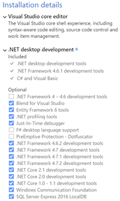
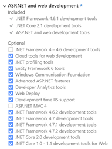
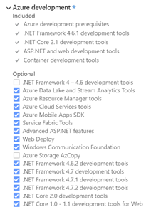
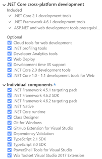

# Cats

This repository is the basis of a tutorial session covering .Net Core, SignalR, TypeScript, Webpack and more.

Prerequisites -

**Visual Studio 2017** I will be using VS2017 Pro - but the community edition should support most of the topics of the tutorial.  VSCode can also be used but will require a lot of plugins.

The workloads and features configured in the environment i used to build the demo are presented below -

Some additional tools I will be using during the demo:

[Whack Whack Terminal](https://marketplace.visualstudio.com/items?itemName=DanielGriffen.WhackWhackTerminal) This extension adds a dockable powershell window in visual studio

[Open Command Line](https://marketplace.visualstudio.com/items?itemName=MadsKristensen.OpenCommandLine) This extension allows you to right click anywhere in the solution explorer and open up a command line (dos) prompt at that location

[Docker For Windows](https://www.docker.com/) We will be using this to create docker images and deploy our images to run as containers locally, in on-prem servers and to a private azure registry.

[Latest LTS version of Node](https://nodejs.org/en/) Node will probably be installed already, but this will make sure you have an up to date version.  Node will be used to run NPM and a variety of other libraries and tools used for client side development (webpack, typescript, etc..)

[Git for Windows](https://git-scm.com/download/win) we will be using a combination of visual studio and CLI tools for cloning, committing, pushing our code to and from the repo in GitHub.

[GitHub Extension for VisualStudio](https://visualstudio.github.com/) I prefer the git CLI in most cases, but i think this is a better merge experience.

[An Azure Account](https://azure.microsoft.com) This will be necessary for the private registry and service fabric docker instance.

[.Net Core 2.2 SDK](https://dotnet.microsoft.com/) This will be the framework we build our web app in.

### Links ###

[A Udemy course on TypeScript I reccomend](https://www.udemy.com/understanding-typescript/)

